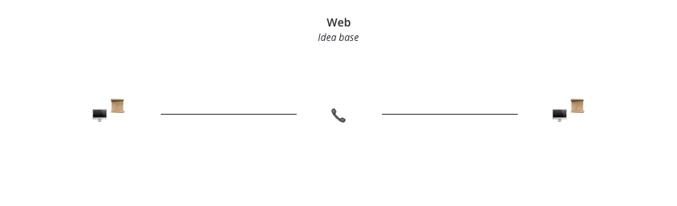
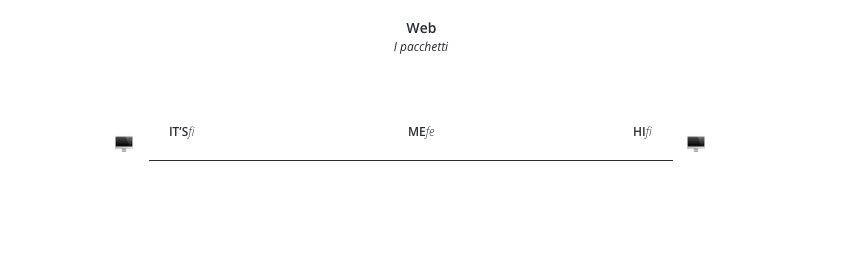
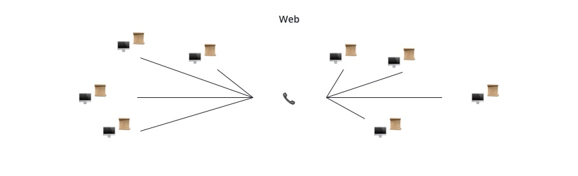

> Questa sezione fa parte del Coding Bootcamp 9 di Edgemony, Learning Week 3. Puoi trovare tutti gli altri contenuti [qui](../lw_03/README.md).

# CB9-LW3 – Breve introduzione al web

### Il web è una grande rete

L'idea alla base del web è quella di due (o più) computer che condividono accesso a delle risorse (ad es., dei documenti). Qualcosa come la seguente immagine,

La comunicazione tra i computer si basa su degli accordi, chiamati protocolli. I protocolli hanno diversi scopi per i quali stabiliscono delle regole di comportamento. Ad esempio, è sempre richiesta _una stretta di mano_ tra due computer per rendere affidabile la loro connessione. Un'altra regola è che quando Computer A chiede un documento a Computer B, quest'ultimo glielo spedisca tramite pacchetti numerati in maniera sequenziale. In questa maniera, Computer A saprà come rimettere tutto nell'ordine corretto, e la trasmissione di informazioni sarà affidabile.

In altre parole, è un po' come l'[alfabeto farfallino](https://it.wikipedia.org/wiki/Alfabeto_farfallino). Se immaginiamo che Computer A abbia chiesto a Computer B il testo di [Anti-Hero di Taylor Swift](https://it.wikipedia.org/wiki/Anti-Hero), il risultato potrebbe somigliare a questo

Nel suo complesso, il web è quindi una grande rete di computer connessi tra loro, che scambiano documenti.

### Tutti i computer sono uguali, ma alcuni sono più uguali degli altri

Se tutti i computer connessi alla rete scambiano documenti tra loro, significa che qualunque computer può richiedere documenti al mio computer? Non esattamente.

Nella maggior parte dei casi – e sicuramente nei casi più utili per noi – uno (o più) computer richiede delle risorse, e uno (o più) computer può fornirle, ma **non si tratta mai degli stessi computer**. In maniera molto schematica, la condivisione di risorse avviene tra un computer che le richide, il _client_, e uno che le fornisce, il _server_. Questo sistema (_client_/_server_) è quello che fa funzionare il web per come compreso dalla maggior parte delle persone.

In [questa sezione](./il-viaggio-di-una-richiesta-web.md), trovi qualche dettaglio in più su come avviene una richiesta web.

##### Link per approfondire

> **FOMO warning!** La curiosità è una cosa bella, ma non perdi nulla di essenziale se non visiti le pagine seguenti.   **Rabbit Hole warning**
> Uno degli errori più fatali è quello di cominciare a leggere senza mai fermarsi.   Prova a seguire questa linea guida:
> leggi **solo se hai una domanda** per la quale cerchi una risposta. Una volta trovata, **fermati**.
> Troverai sempre qui questi link, così da visitarli al momento guisto.

1. [Storia del WWW](https://it.wikipedia.org/wiki/Storia_del_World_Wide_Web) su Wikipedia
1. [Il protocollo HTTP](https://it.wikipedia.org/wiki/Hypertext_Transfer_Protocol) su Wikipedia
1. [La stretta di mano tra i computer](https://it.wikipedia.org/wiki/Transmission_Control_Protocol#Apertura_di_una_connessione_-_Three-way_handshake) su Wikipedia
1. [La architettura client/server](https://it.wikipedia.org/wiki/Sistema_client/server) su Wikipedia
