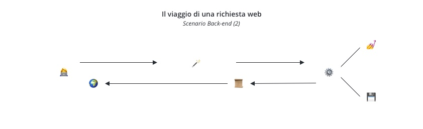
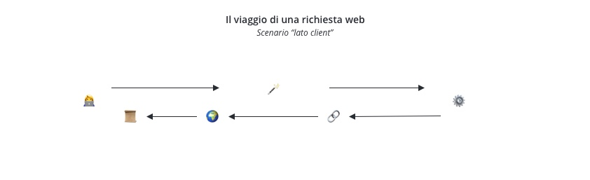
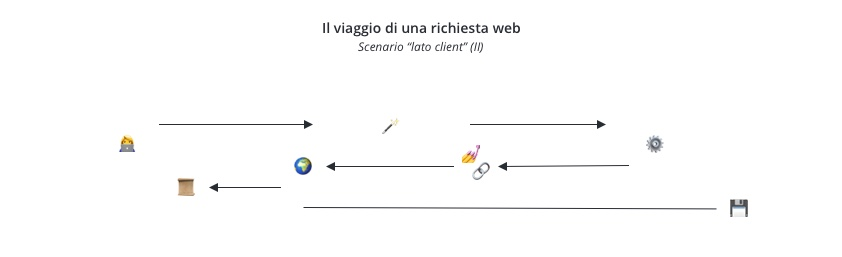
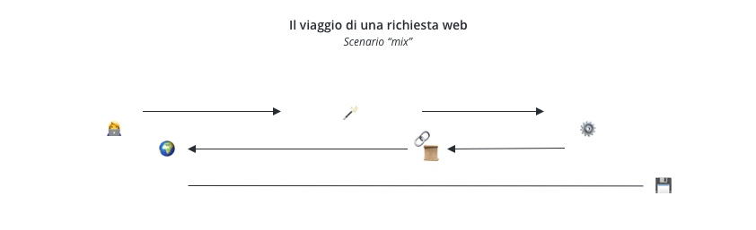

> Questa sezione fa parte del Coding Bootcamp 9 di Edgemony, Learning Week 3.
> Puoi trovare tutti gli altri contenuti della LW [qui](../lw_03/README.md).

# CB9-LW3 – Il viaggio di una richiesta web

La [breve introduzione al web](./breve-introduzione-al-web.md) considera il
sistema _client_/_server_ l'archetipo della comunicazione web.

### Una prima differenza: back-end e front-end

Tipicamente, il _client_ che inizia la richiesta è il browser. Nei casi più
comuni, la richeista restituisce un documento. Se fate click su
<a href="https://edgemony.com/" target="_blank">edgemony.com/</a>, una buona
approssimazione iniziale del viaggio della richiesta somiglia a qualcosa del
genere,

Da un lato abbiamo il _server_, che si occupa di procurare il documento tramite
una serie di operazioni che possono variare in base al tipo di risorsa richiesta
(ad es., come è stata creata, salvata, ecc.). I dettagli di queste operazioni
sono molto interessanti, ma ci porterebero molto lontano, ed esulano dall'ambito
del corso. La programmazione di queste operazioni è solitamente responsabilità
delle figure conosciute come _Back-end engineers_ (o developers, ecc.).

Dall'altro lato abbiamo il _client_, ovvero il browser, il quale esegue tutte le
operazioni (ad es., legge, interpreta, ecc.) che ci permettono di vedere il
documento ricevuto come "la homepage di Edgemony". Le operazioni del browser ci
interessano più da vicino. Infatti, il risultato di queste dipende in grossa
parte dal lavoro svolto dalle figure conosciute come _Front-end engineers_ (o
developers, ecc.).

Così come _server_ e _client_ non lavorano allo stesso modo, _back-end_ e
_front-end_ engineers non condividono sempre le stesse competenze e
responsabilità. Proviamo a individuarne alcune, prendendo l'esembio emblematico
di creare una pagina web.

**Nota**: Da questo momento, faremo riferimento alle operazioni citate in
precedenza con la formula "creare una pagina web" o simili. Di certo, le cose
sono più complesse di così, ma questo ci aiuta ad afferrare l'essenziale
tralasciando i dettagli che, per adesso, non sono utili.

### Una seconda differenza: pagina statica e pagina dinamica

Quando richiediamo una pagina web, questa può già esistere all'interno del
_server_, tipicamente come pagina HTML (ad es., `index.html`). Il compito del
_server_ sarà allora quello di trovarla, e restituirla. In questo caso, la
pagina web è statica, e ciò che accade somiglia a qualcosa del genere,

In un secondo caso, la pagina HTML non esiste sul _server_. In altre parole, se
andassimo a cercare sul _server_, non troveremmo alcuna `index.html`. Quello che
esiste, invece, è un documento che il _server_ usa come base per **creare in
maniera dinamica** la pagina richiesta. Nella pratica, ci sono molti modi di
realizzare questa cosa. In termini astratti, possiamo immaginare questo
documento come contenent del codice scritto in un linguaggio che il _server_ può
capire (ad es., _JavaScript_, _PHP_, ecc.). Il codice fornisce le istruzioni che
il _server_ seguirà per generare il documento finale da restituire. In questo
caso, la pagina web è generata in maniera dinamica. Ciò che accade somiglia a
qualcosa del genere,

Fin qui, abbiamo descritto come il _server_ genera pagine statiche o dinamiche.

### Una terza differenza: generazione lato _server_ e lato _client_

Che sia dinamica o statica, nei casi descritti finora, la pagine viene generata
dal _server_. Nel caso più semplice possibile, il _client_ (ossia, il browser)
si limiterà a svolgere le operazioni per visualizzare la pagina. Queste vengono
anche chiamate **processi di render**. Sono processi molto interessanti ai quali
faremo accenno, senza andare nello specifico, più avanti nel corso di volta in
volta, in base alle necessità.

Tuttavia, il _client_ può anche essere responsabile della stessa generazione
della pagina web. In questo caso, potremmo dire quasi per definiziione, la
pagina è sempre generata in maniera dinamica. In uno scenario tipico di
generazione lato _client_, quindi, avviene qualcosa del genere,

Anche se il lavoro del server è diverso, resta comunque molto importante. In
alcuni casi, lo scenario sarà più simile a qualcosa del genere,

Probabilmente, **il caso più comune** è quello misto, ovvero quello nel quale il
_server_ restituisce una pagina (dinamica o statica) la quale contiene ulteriori
istruzioni per essere poi modificata dal _client_ nel corso della sua vita.
Qualcosa del genere,

### Per riassumere, e una tabella

_Client_ e _server_ hanno storicamente avuto responsabilità diverse. Il primo
richiede le risorse, l'altro le restituisce; il primo le legge e interpreta,
l'altro le crea. In anni più recenti, entrambi hanno iniziato a condividere la
responsabilità di creare una pagina web. Ciò ha reso il lavoro di Back-end e
Front-end engineers sicuramente più complesso, ma anche più gratificante,
considerando le moltemplici possibilità offerte.

|        | Dinamica | Statica | Misto |
| ------ | -------- | ------- | ----- |
| Server | 🟢       | 🟢      | 🟢    |
| Client | 🟢       | 🔴      | 🟢    |

Il resto del Bootcamp si concentrerà sugli strumenti che permettono di creare
pagine web lato _client_. Prima di questo però, sarà bene
[occuparsi di Git](usare-git.md), uno strumento fondamentale nella carriera di
software engineer.

## Link per approfondire

> **FOMO warning!** La curiosità è una cosa bella, ma non perdi nulla di
> essenziale se non visiti le pagine seguenti.   **Rabbit Hole warning!**
> Uno degli errori più fatali è quello di cominciare a leggere senza mai
> fermarsi.   Prova a seguire questa linea guida: leggi **solo se hai una
> domanda** per la quale cerchi una risposta. Una volta trovata, **fermati**.
> Troverai sempre qui questi link, così da visitarli al momento guisto.

1. [Cosa è un Index](<https://it.wikipedia.org/wiki/Index_(informatica)>) su
   Wikipedia
1. [Cosa è un browser](https://it.wikipedia.org/wiki/Browser) su Wikipedia
1. [I processi di render del browser](https://developer.chrome.com/blog/inside-browser-part3)
   su Chrome for Developers (in inglese)
