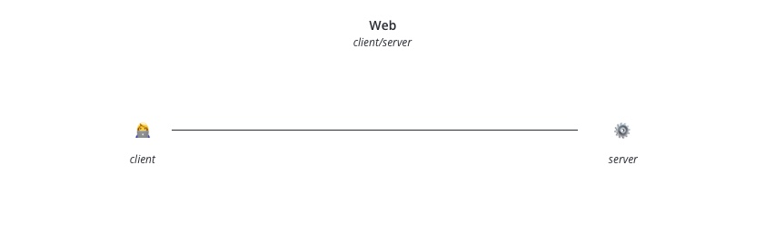
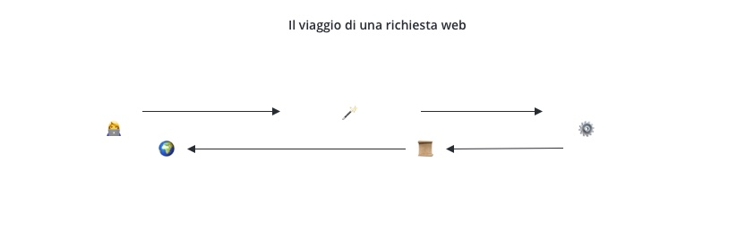

> Questa sezione fa parte del Coding Bootcamp 9 di Edgemony, Learning Week 3. Puoi trovare tutti gli altri contenuti [qui](../lw_03/README.md).

# CB9-LW3 – Il viaggio di una richiesta web

La [breve introduzione al web](./breve-introduzione-al-web.md) considera il sistema _client_/_server_ l'archetipo della comunicazione web.

La richiesta di un _client_, nei casi più comuni, restituisce un documento. Il _server_ si occupa di procurare il documento tramite una serie di operazioni che possono anche variare in base al tipo di risorsa richiesta, a come questa è creata, salvata, ecc. I dettagli di queste operazioni sono interessanti, ma ci porterebero molto lontano, ed esulano dall'ambito del corso. Una buona approssimazione iniziale del processo somiglia a qualcosa del genere,

