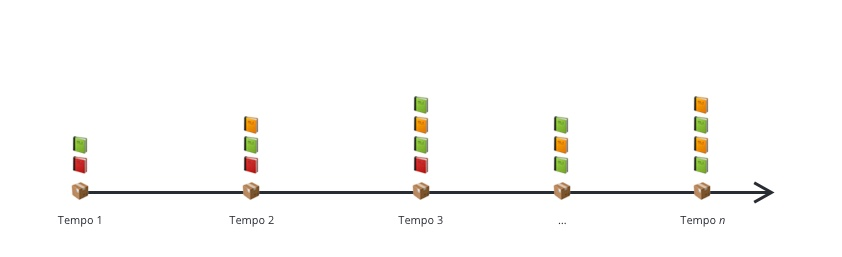
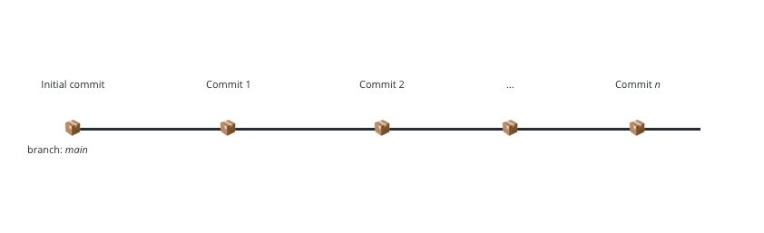
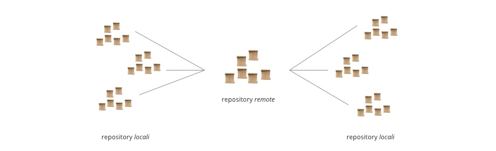
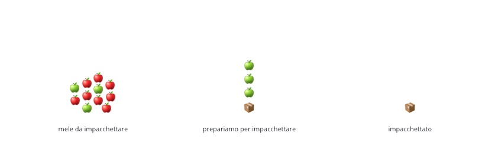
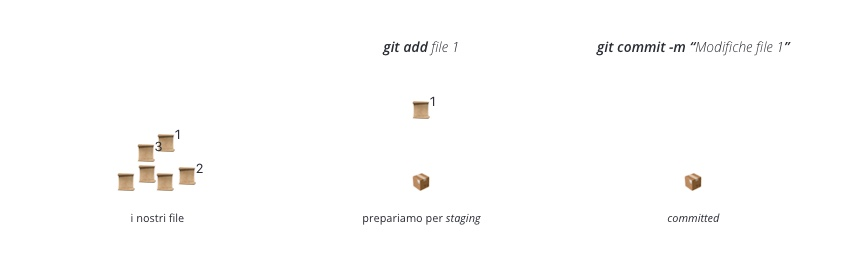

> Questa sezione fa parte del Coding Bootcamp 9 di Edgemony, Learning Week 3.
> Puoi trovare tutti gli altri contenuti della LW [qui](../lw_03/README.md).

# CB9-LW3 – Usare Git

### Cosa è Git?

I concetti necessari inizialmente per poter lavorare con Git sono:
`Linea termporale` e `Istantanea`. Una prima approsimazione di cosa è Git: Una
sequenza di istantanee disposte lungo una linea temporale. Ovvero, qualcosa del
genere,

Nel gergo di Git, la linea temporale è detta `branch`, mentre l'instantane è
chiamata `commit`. L'immagine sopra diventa qualcosa del genere,

### Repository

Git lavora su collezioni di file e cartelle che chiamiamo `repository`. In
italiano, dovremmo dire `magazzino` o `deposito`, ma ha poco senso. Terremo
quindi la versione in inglese _repository_.

> **Fun fact**: parlare di _repository_ in italiano è come parlare di arancin\*
> in siciliano. La questione del femminile o maschile è ancora in fase di
> risoluzione. Tuttavia, ci sono buone ragioni per pensare che sia maschile.

La _repository_ è quindi il luogo dove avvengono tutte le operazioni che noi
compiamo su file e cartelle tramite Git. Un esempio di _repository_ è quella che
stai navigando adesso.

### Remota e locale

Ogni _repository_ può essere clonata. Possiamo pensare al clone di una
_repository_ come **la stessa repository** ma in locale (ossia, sul nostro PC
invece che su un server). Quindi, la _repository_ principale sarà quella remota,
e sarà unica. Tutte le altre copie, saranno quelle locali. Qualcosa di simile
all'immagine seguente,

È possibile ottenere una copia locale della _repository_ tramite il comando
`git clone`.
[Qui](https://github.com/dev-edgemony/CB9/blob/main/lw_03/esercitazioni/README.md#1-clona-la-repository-cb9)
trovi una esercitazione utile.

> **Nota bene**: clonare una _repository_ non è la stessa cosa di creare un
> fork. Nel primo caso, infatti, il link tra la _repository_ remota e quella
> locale è pressoché indissolubile. In altre parole, una _repository_ locale
> trae la sua identità dal link con quella remota.

Una delle funzioni delle _repository_ locali è quella di permettere ai singoli
individui di apportare modifiche senza che queste abbiano effetto sulla remota.
Allo stesso tempo, una _repository_ locale ha poca utilità se non quella di
permettere di contribuire alle modifiche della _repository_ remota. A questo
fine, esiste un flusso di lavoro.

Prima di trattare il flusso di lavoro, è utile trattare i tre stati (più uno)
nei quali i file di una _repository_ locale si possono trovare.

### Il flusso di lavoro Git in tre step

Non appena clonata, la _repository_ locale è identica a quella remota. In
particolare, rappresenta al sua stessa storia, la sequenza di _commit_ alla
quale accennavamo [in precedenza](#cosa-è-git).

Apportare una modifica richiede **un flusso di lavoro in tre step**. Per
iniziare, possiamo immaginarlo come qualcosa del genere,

I comandi Git che ci permettono di passare da uno step all'altro sono,

1. `git add`
1. `git commit`

Facendo riferimento all'analogia precedente, avremo qualcosa del genere,

In realtà, usare solo i comandi non ci porterebbe avanti, perché Git vuole
sapere _cosa_ vogliamo aggiungere e _cosa_ stiamo impacchettando. In altre
parole, qualcosa del genere,

### Tre stati, più uno

Proviamo a uscire dall'analogia delle mele, e parlare di file. Il flusso di
lavoro in tre step somiglia a qualcosa del genere,

Ogni passaggio corrisponde a uno stato (i colori sono scelti in modo casuale):

1. in giallo, i file sono nello stato _modified_
1. in rosso, i file sono nello stato _staged_
1. in verde, i file sono nello stato _committed_

Quale è il quarto stato? In effetti, sarebbe lo stato iniziale, ovvero, ad es.,
lo stato di quando abbiamo clonato la _repository_. Tuttavia, poiché anche una
_repository_ al suo inizio deve avere almeno un _commit_, possiamo pensare allo
stato iniziale e allo stato _committed_ come sostanzialmente lo stesso stato.

> **Nota**: in qualunque momento, puoi interrograre lo stato della _repository_
> usando `git status`.

Una sequenza temporale di _commit_ ci restituirà una immagine come quella vista
all'inizio, qualcosa del genere,

[Qui](https://github.com/dev-edgemony/CB9/blob/main/lw_03/esercitazioni/README.md#2-il-mio-primo-commit)
trovi una esercitazione utile.

### Modificare la repository remota

Una volta completato il flusso in tre step, abbiamo ottenuto che la nostra
_repository_ locale è stata modificata. Ma come facciamo a modificare quella
remota?

## Link per approfondire

> **FOMO warning!** La curiosità è una cosa bella, ma non perdi nulla di
> essenziale se non visiti le pagine seguenti.   **Rabbit Hole warning!**
> Uno degli errori più fatali è quello di cominciare a leggere senza mai
> fermarsi.   Prova a seguire questa linea guida: leggi **solo se hai una
> domanda** per la quale cerchi una risposta. Una volta trovata, **fermati**.
> Troverai sempre qui questi link, così da visitarli al momento guisto.

1. [Cos'è Git?](https://git-scm.com/book/it/v2/Per-Iniziare-Cos%E2%80%99%C3%A9-Git%3F)
   sul sito ufficiale
1. [Anatomia dell'arancin\*](https://www.instagram.com/p/CILMYH3hGjq/?img_index=1)
   su Instagram
